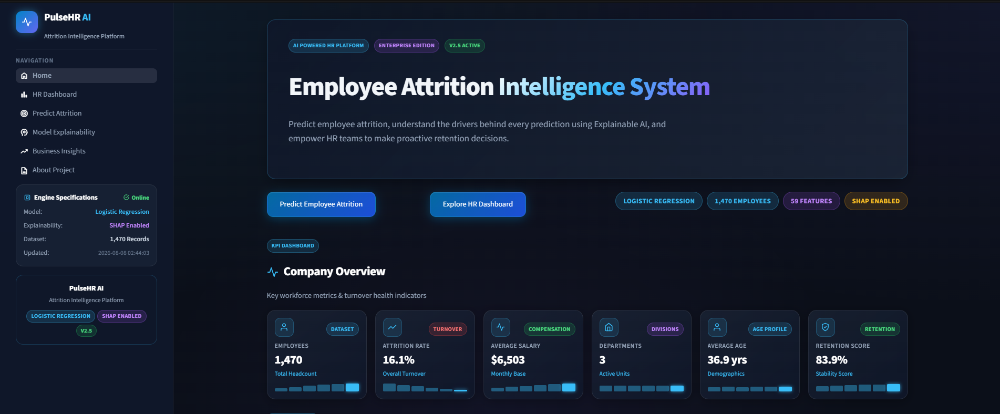
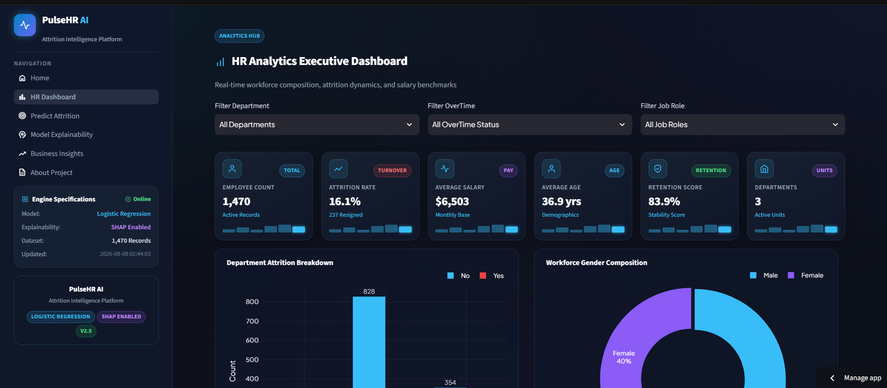
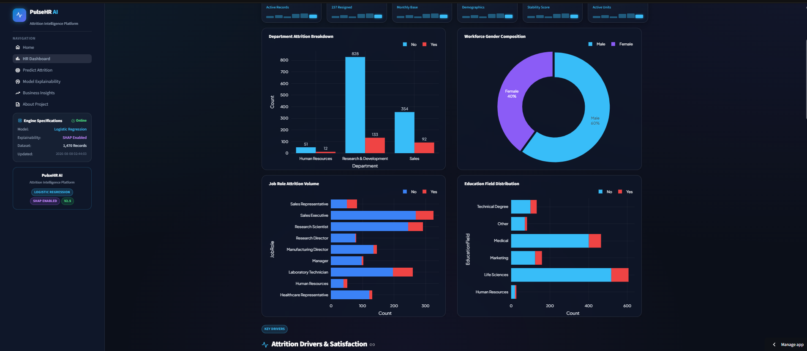
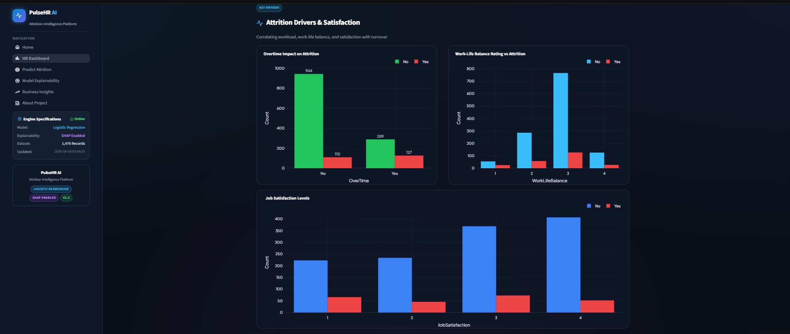
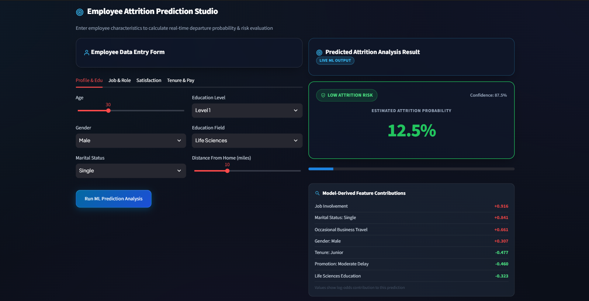
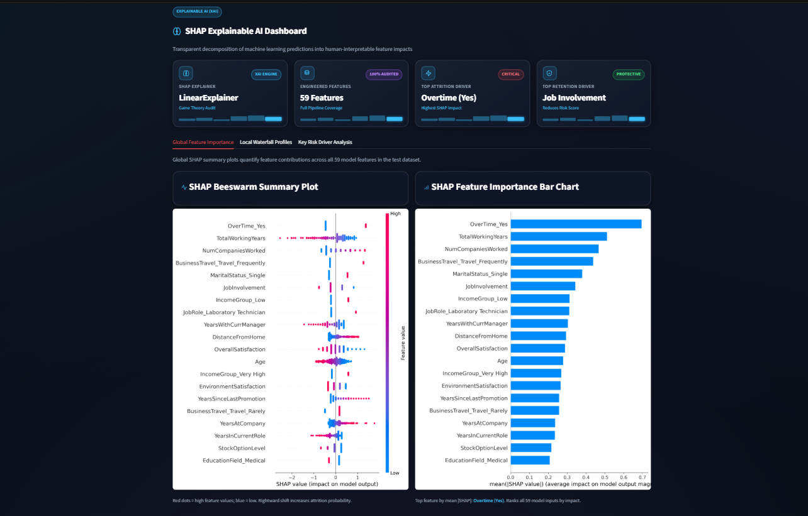

# 🚀 PulseHR AI – Employee Attrition Analytics

An end-to-end **HR Analytics and Explainable AI** platform that predicts employee attrition risk, provides actionable HR recommendations, and visualizes workforce trends through an interactive dashboard.

Built using **Machine Learning, Streamlit, Plotly, SHAP, and Scikit-learn**, PulseHR AI helps HR professionals identify employees at risk of leaving and supports data-driven retention strategies.

---

## 🌐 Live Demo

**Live Application:** *(https://employee-attrition-analytics-lfttppwokkzaezwb9ruxtb.streamlit.app/)*

**GitHub Repository:** *(https://github.com/taranvir05/Employee-Attrition-Analytics)*

---

# 📌 Project Overview

Employee attrition is one of the biggest challenges faced by organizations. Losing experienced employees increases recruitment costs, affects productivity, and impacts business performance.

PulseHR AI addresses this challenge by combining:

- HR Analytics
- Machine Learning
- Explainable AI (SHAP)
- Interactive Business Dashboards
- Executive PDF Reporting

to help HR teams make informed retention decisions.

---

# ✨ Key Features

## 📊 Interactive HR Dashboard

- Workforce KPIs
- Department-wise analysis
- Job Role analysis
- Overtime impact
- Attrition trends
- Dynamic filtering

---

## 🎯 Employee Attrition Prediction

Predicts whether an employee is likely to leave using a trained Logistic Regression model.

Outputs include:

- Attrition Risk
- Probability Score
- Confidence Level
- Risk Category
- HR Recommendations

---

## 🧠 Explainable AI (SHAP)

Provides transparent model explanations using SHAP.

Includes:

- SHAP Summary Plot
- SHAP Feature Importance
- Individual Waterfall Explanation

Shows **why** the model predicted attrition.

---

## 📈 Business Insights

Answers important HR questions:

- Which department loses the most employees?
- Which job roles have the highest attrition?
- Does overtime increase attrition?
- Which age group is most at risk?
- What are the major business drivers?

---

## 📄 Executive PDF Report

Generates a professional HR report including:

- Prediction Summary
- Risk Probability
- Feature Contributions
- HR Recommendations
- Retention Strategy

---
## 📸 Project Preview

### 🏠 PulseHR AI — Workforce Overview
The landing dashboard provides a quick overview of workforce health, key HR metrics, model information, and navigation to the core analytics modules.



---

### 📊 HR Analytics Dashboard
Interactive workforce analytics with filters and visualizations covering department attrition, overtime impact, job-role patterns, work-life balance, and other key HR indicators.







---

### 🎯 Employee Attrition Prediction
Predicts an employee's attrition risk from their HR profile and provides the predicted probability, risk category, and actionable HR recommendations.



---

### 🧠 Explainable AI with SHAP
Explains the factors influencing individual attrition predictions using SHAP, making the model's decisions transparent and interpretable.




# 🏗 Project Architecture

```
Employee Data
       │
       ▼
Data Cleaning
       │
       ▼
Feature Engineering
       │
       ▼
Preprocessing
       │
       ▼
Model Training
       │
       ▼
Best Model Selection
       │
       ▼
Prediction Engine
       │
       ▼
SHAP Explainability
       │
       ▼
Interactive Dashboard
       │
       ▼
Executive PDF Report
```

---

# 📊 Model Performance

**Best Performing Model:** Logistic Regression

| Metric | Score |
|---------|--------|
| Accuracy | **87.76%** |
| Precision | **73.91%** |
| Recall | **36.17%** |
| F1 Score | **48.57%** |
| ROC-AUC | **83.26%** |

---

# 🧩 Feature Engineering

Created domain-specific HR features including:

- Overall Satisfaction
- Income Group
- Experience Group
- Promotion Delay
- Distance Category
- Tenure Group

These engineered features improved business interpretability and model performance.

---

# 🛠 Tech Stack

### Frontend

- Streamlit

### Machine Learning

- Scikit-learn
- SHAP

### Data Processing

- Pandas
- NumPy

### Visualization

- Plotly
- Matplotlib
- Seaborn

### PDF Reporting

- FPDF2

---

# 📂 Project Structure

```
Employee-Attrition-Analytics/

├── app.py
├── pages/
├── utils/
├── models/
├── notebooks/
├── images/
├── data/
├── requirements.txt
└── README.md
```

---

# 📊 Dataset

IBM HR Employee Attrition Dataset

The dataset contains employee demographic, job, salary, experience, and satisfaction information used to predict attrition.

---

# 🚀 Installation

```bash
git clone <repository-url>

cd Employee-Attrition-Analytics

pip install -r requirements.txt

streamlit run app.py
```

---

# 🔮 Future Enhancements

- Real-time HR database integration
- Multi-model comparison dashboard
- Department-level forecasting
- Email alerts for high-risk employees
- Workforce trend forecasting
- Cloud deployment with authentication

---

